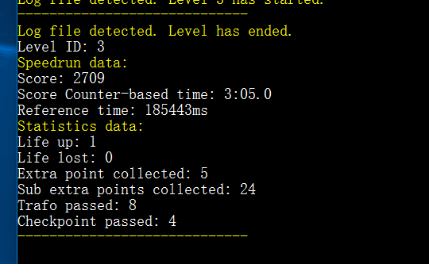

# ScoreManager-Core

A [Ballance](https://en.wikipedia.org/wiki/Ballance) game plugin provides speedrun and statistics data exporting.

This repository contains the core functions of ScoreManager, including `menulevel.nmo` injection, data capture, verify and analyze.

## Tutorial

Clone, Compile and Run.

Requires .NET Framework 4.5 or later, but 4.0 should works.

See [Releases](https://github.com/BearKidsTeam/ScoreManager-Core/releases) for pre-compiled binary files.

## Hints

Put it in any folder, it will automatically search Ballance location in registry and do game file injection. If it returns a failure, you need to manually input it.

If you are running it and Ballance in your system partition, please use `Run as Administrator` (The program itself should has been configured in `app.manifest`, but you must configure Ballance `Player.exe` by yourself).

## License

MIT License (see [`LICENSE`](https://github.com/BearKidsTeam/ScoreManager-Core/blob/master/LICENSE) file).
